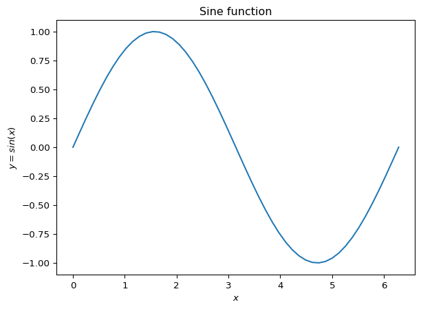

# Week 1


Note that, in this demo we have not used a `src/` layout, since Quarto
seems to have trouble generating into an output dir. Instead we opt for
a *flat* layout.

In this demo, we will generate a figure which plots the sine function
using the `numpy` library.

First, we generate the input `x` by running the `np.linspace` method,
which requires 3, inputs `(start, end, n_points)`.

``` python
import numpy as np

x = np.linspace(0, 2*np.pi, 50)
```

Now, we want to evaluate these points using the sine method provided by
numpy; `np.sin` and plot the graph using `matplotlib.pyplot`.

``` python
import matplotlib.pyplot as plt

y = np.sin(x)

plt.plot(x,y)
plt.title("Sine function")
plt.xlabel("$x$")
plt.ylabel("$y = sin(x)$")
plt.show()
```


