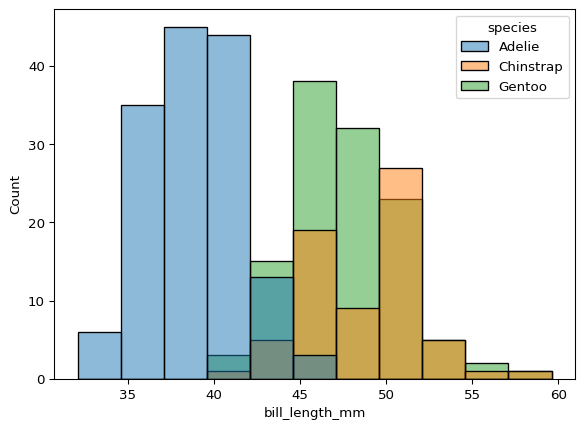
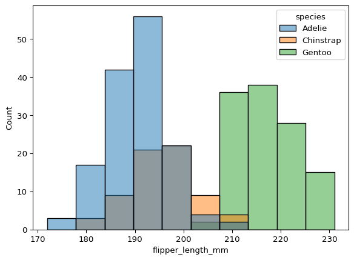
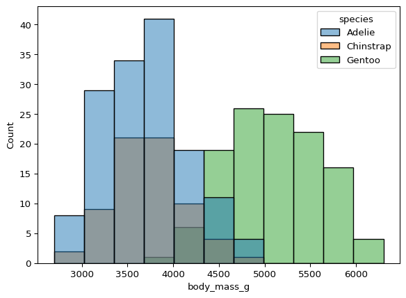

# Week 3


> Question: Can we distinguish penguin species based on simple body
> measurements?

# The data

``` python
import seaborn as sb
import matplotlib.pyplot as plt

penguins = sb.load_dataset("penguins")
penguins.head()
```

<div>
<style scoped>
    .dataframe tbody tr th:only-of-type {
        vertical-align: middle;
    }
&#10;    .dataframe tbody tr th {
        vertical-align: top;
    }
&#10;    .dataframe thead th {
        text-align: right;
    }
</style>

|  | species | island | bill_length_mm | bill_depth_mm | flipper_length_mm | body_mass_g | sex |
|----|----|----|----|----|----|----|----|
| 0 | Adelie | Torgersen | 39.1 | 18.7 | 181.0 | 3750.0 | Male |
| 1 | Adelie | Torgersen | 39.5 | 17.4 | 186.0 | 3800.0 | Female |
| 2 | Adelie | Torgersen | 40.3 | 18.0 | 195.0 | 3250.0 | Female |
| 3 | Adelie | Torgersen | NaN | NaN | NaN | NaN | NaN |
| 4 | Adelie | Torgersen | 36.7 | 19.3 | 193.0 | 3450.0 | Female |

</div>

Unique species of penguins

``` python
species = penguins.loc[:, "species"]
unique_species = species.unique()
for species in unique_species:
    print(species)
```

    Adelie
    Chinstrap
    Gentoo

Extract the \`numerical colums\`\`

``` python
numerical_columns = ["bill_length_mm","bill_depth_mm", "flipper_length_mm", "body_mass_g"]
```

Size of dataset

``` python
penguins.shape
```

    (344, 7)

# Process Data

Remove Na’s

``` python
cleaned_penguins = penguins.dropna()
print(f"size of remaning data {cleaned_penguins.shape}" )
```

    size of remaning data (333, 7)

# Analyse data

## Univariate Analysis

``` python
for num_col in numerical_columns:
    sb.histplot(cleaned_penguins, x=num_col, hue="species")
    plt.show()
```








## Multivariate Analysis

``` python
sb.pairplot(cleaned_penguins, vars=numerical_columns, hue="species")
```


## QUIZ!!!

``` python
index = [247, 0]

cleaned_penguins.loc[index, numerical_columns]
```

<div>
<style scoped>
    .dataframe tbody tr th:only-of-type {
        vertical-align: middle;
    }
&#10;    .dataframe tbody tr th {
        vertical-align: top;
    }
&#10;    .dataframe thead th {
        text-align: right;
    }
</style>

|     | bill_length_mm | bill_depth_mm | flipper_length_mm | body_mass_g |
|-----|----------------|---------------|-------------------|-------------|
| 247 | 47.8           | 15.0          | 215.0             | 5650.0      |
| 0   | 39.1           | 18.7          | 181.0             | 3750.0      |

</div>

### Answer

``` python
cleaned_penguins.loc[index, "species"]
```

    247    Gentoo
    0      Adelie
    Name: species, dtype: object

> Question: How do measurements vary across islands and sex?
